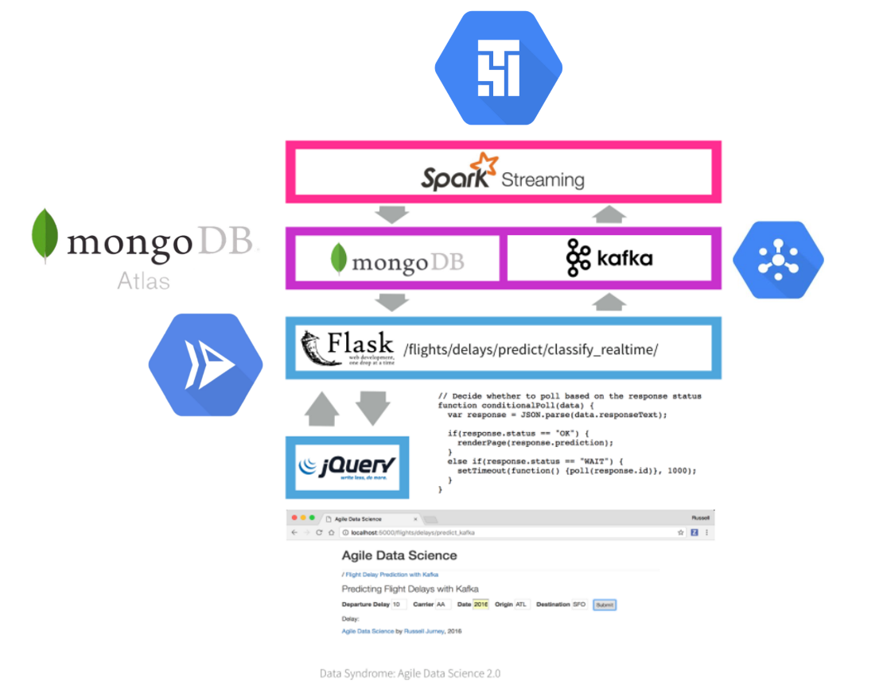
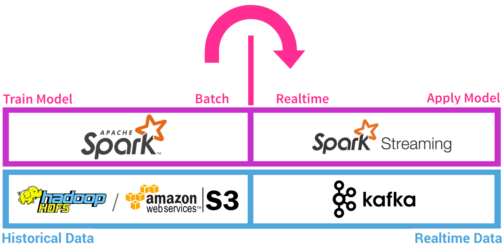
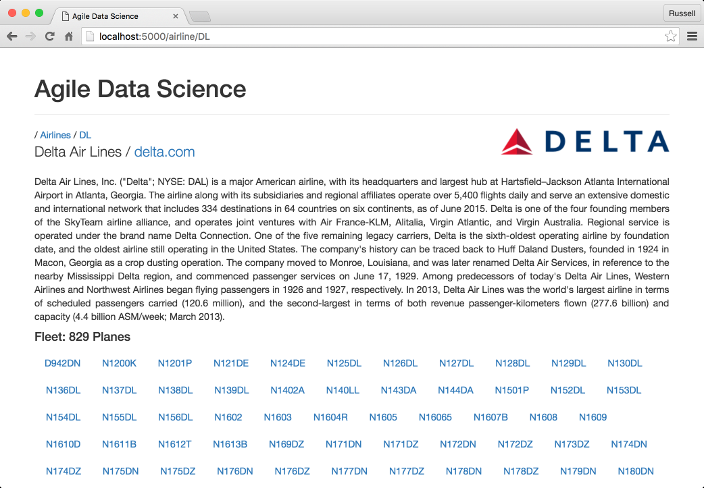
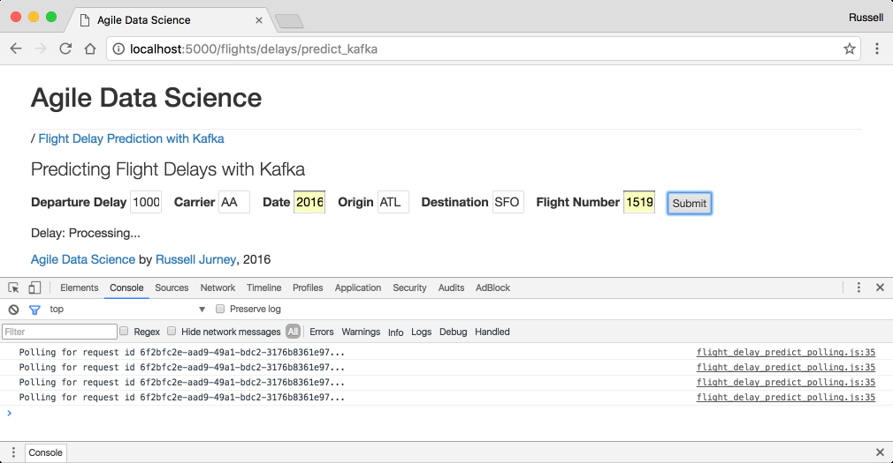

El objetivo de este documento es describir cómo orquestrar la ejecución de disintos scritps (como pipeline de proceso de datos) con el fin de cumplir los siguientes objetivos:

- [ ] [4 pts] Lograr el funcionamiento de la práctica sin realizar modificaciones.
- [ ] [1 pto] Ejecución del job de predicción con Spark Submit en vez de IntelliJ.
- [ ] [1 pto] Dockerizar cada uno de los servicios que componenen la arquitectura completa.
- [ ] [2 pto] Desplegar el escenario completo usando kubernetes.
- [ ] [1 pto] Desplegar el escenario completo en Google Cloud/AWS.
- [ ] [2 ptos] Cambiar mongodb por Cassandra.

Para ello se sigue y documenta cada paso del siguiente proceso. En resumen, cada paso conlleva la ejecución de un cierto script que está relacionado con el despliegue de unos servicios (spark, kafka) en una máquina: a continuación se describe cómo se ejcuta en una máquina cada script del proceso y qué resultado se obtiene. Con ello, se consigue depurar estos scripts con el fin de poder adaptarlos para que se ejecuten con airflow o en gcp.

1. Descargar los datos de vuelos pasados.
2. Entrenar el modelo de machine learning.
3. Desplegar el job de Spark que predice el retraso de los vuelos usando el modelo creado. 
4. Por medio de una interfaz web, el usuario introducirá datos del vuelo a predecir, que se enviarán al servidor web de Flask.
5. El servidor web enviará estos datos al job de predicción a través de Kafka.
6. El job realizará la predicción y la guardará en Mongo.
7. La interfaz web está constantemente haciendo pollingpara comprobar si se ha realizado ya la predicción.
8. En caso afirmativo se muestra la predicción en la interfaz.

```bash
# 0. Clonar el repo e instalar python3, spark, zookeeper y kafka.


# 0.1 descargar y comrpobar que funciona


# Instalar spark 2.4.7 (para entrenar y realizar las predicciones). Se despliega un nodo máster local [https://phoenixnap.com/kb/install-spark-on-ubuntu]
sudo apt-get update
sudo apt install openjdk-8-jre openjdk-8-jdk-headless scala git curl -y
java -version; javac -version; scala -version; git --version
wget https://ftp.cixug.es/apache/spark/spark-2.4.7/spark-2.4.7-bin-hadoop2.7.tgz && pwd && tar -xvf spark-2.4.7-bin-hadoop2.7.tgz
sudo mv spark-2.4.7-bin-hadoop2.7 /opt/spark 

echo "export SPARK_HOME=/opt/spark" >> ~/.profile
echo "export PATH=$PATH:$SPARK_HOME/bin:$SPARK_HOME/sbin" >> ~/.profile
echo "export PYSPARK_PYTHON=/usr/bin/python3" >> ~/.profile
echo "export JAVA_HOME=/usr/lib/jvm/java-1.8.0-openjdk-amd64" >> ~/.profile
echo "export PROJECT_HOME=/home/ubuntu/practica_big_data" >> ~/.profile
source ~/.profile

rm spark-2.4.7-bin-hadoop2.7.tgz

start-master.sh

# Zookeeper 3.6.2
wget https://apache.brunneis.com/zookeeper/zookeeper-3.6.2/apache-zookeeper-3.6.2-bin.tar.gz && pwd && tar -xvf apache-zookeeper-3.6.2-bin.tar.gz

rm apache-zookeeper-3.6.2-bin.tar.gz

# kafka 2.3.
#Este primer link da problemas con graddle (ver foro), se usa versión 2.6
# wget https://archive.apache.org/dist/kafka/2.3.0/kafka-2.3.0-src.tgz && pwd && tar -xvf kafka-2.3.0-src.tgz
wget https://apache.brunneis.com/kafka/2.6.0/kafka_2.13-2.6.0.tgz && pwd && tar -xvf kafka_2.13-2.6.0.tgz

rm kafka_2.13-2.6.0.tgz

# Create a conf
cd apache-zookeeper-3.6.2-bin/conf
touch "zoo.cfg"
echo "tickTime=2000" >> zoo.cfg
echo "dataDir=/var/zookeeper" >> zoo.cfg
echo "clientPort=2181" >> zoo.cfg
cd ..
sudo bin/zkServer.sh start
sudo bin/zkServer.sh stop
cd ..

# Clonar el repo

git clone https://github.com/BDFI/practica_big_data.git

# Mongo
wget -qO - https://www.mongodb.org/static/pgp/server-4.4.asc | sudo apt-key add -
#echo "deb [ arch=amd64,arm64 ] https://repo.mongodb.org/apt/ubuntu focal/mongodb-org/4.4 multiverse" | sudo tee /etc/apt/sources.list.d/mongodb-org-4.4.list
# The last version for 20 this for 18 ubuntu
echo "deb [ arch=amd64,arm64 ] https://repo.mongodb.org/apt/ubuntu bionic/mongodb-org/4.4 multiverse" | sudo tee /etc/apt/sources.list.d/mongodb-org-4.4.list
sudo apt-get update
sudo apt-get install -y mongodb-org

echo "mongodb-org hold" | sudo dpkg --set-selections
echo "mongodb-org-server hold" | sudo dpkg --set-selections
echo "mongodb-org-shell hold" | sudo dpkg --set-selections
echo "mongodb-org-mongos hold" | sudo dpkg --set-selections
echo "mongodb-org-tools hold" | sudo dpkg --set-selections


# Instalar pip
sudo apt update
sudo apt install python3-pip
pip3 --version

pip3 install -r requirements.txt

# sbt

echo "deb https://dl.bintray.com/sbt/debian /" | sudo tee -a /etc/apt/sources.list.d/sbt.list
curl -sL "https://keyserver.ubuntu.com/pks/lookup?op=get&search=0x2EE0EA64E40A89B84B2DF73499E82A75642AC823" | sudo apt-key add
sudo apt-get update
sudo apt-get install sbt

# 0.2 Desplegar

cd kafka_2.13-2.6.0

# Zookeeper: en una consola nueva en el directorio de descarga de kafka
bin/zookeeper-server-start.sh config/zookeeper.properties

# kafka: en una consola nueva en el directorio de descarga
cd kafka_2.13-2.6.0
bin/kafka-server-start.sh config/server.properties

 # En otra consola se crea un topic
  cd kafka_2.13-2.6.0 
  
      bin/kafka-topics.sh \
          --create \
          --zookeeper localhost:2181 \
          --replication-factor 1 \
          --partitions 1 \
          --topic flight_delay_classification_request
 
 # Debe aparecer el siguiente mensaje: 

    # Created topic "flight_delay_classification_request".
  
 # Se inspecciona la lista de topics:
 
      bin/kafka-topics.sh --list --zookeeper localhost:2181
  
 # Salida:  flight_delay_classification_request
  
# (Opcional) En una nueva consola se puede abir un consumidor para ver los mensajes que se envían a este topic.

  
  bin/kafka-console-consumer.sh \
      --bootstrap-server localhost:9092 \
      --topic flight_delay_classification_request \
      --from-beginning
 
 # Mongo en otra consola
 
sudo systemctl start mongod
service mongod status

# Spark

start-master.sh

# 1. Descargar los datos de vuelos pasados.

./resources/download_data.sh

./resources/import_distances.sh

# 2. Entrenar el modelo de machine learning.

python3 resources/train_spark_mllib_model.py .

# 3. Desplegar el job de Spark que predice el retraso de los vuelos usando el modelo creado. 

# Cambiar en cada caso el valor de val base_path y de project home 
# /home/ubuntu/practica_big_data

# Se compila y se ejcuta el predictor de scala
# Se obtienen los comando de este link
# https://alvinalexander.com/scala/sbt-how-to-compile-run-package-scala-project/
cd flight_prediction
sbt compile
#sbt run (no funciona)
# para obtener el jar
sbt package
#Se ejecuta spark submit en vez de sbt run (asegurarse antes con el comando: source ~/.profile que está actualizado el .profile)
spark-submit flight_prediction/target/scala-2.11/flight_prediction_2.11-0.1.jar --packages org.mongodb.spark:mongo-spark-connector_2.13:2.6.0,org.apache.spark:spark-sql-kafka-0-10_2.11:2.4.7

# 4. Por medio de una interfaz web, el usuario introducirá datos del vuelo a predecir, que se enviarán al servidor web de Flask.

python3 resources/web/predict_flask.py

# 5. El servidor web enviará estos datos al job de predicción a través de Kafka.

# Se comprueba este mensaje en la consola de kafka

# 6. El job realizará la predicción y la guardará en Mongo.

python3 resources/fetch_prediction_requests.py

# 7. La interfaz web está constantemente haciendo pollingpara comprobar si se ha realizado ya la predicción.
# 8. En caso afirmativo se muestra la predicción en la interfaz.


```


Si se desea despelgar la arquitectura completa en GCP se podrían resumir así los pasos:



1. Descargar los datos de vuelos pasados 
=> Se ejecuta el script download_data.sh y se guardan los datasets en **cloud storage**
2. Entrenar el modelo de machine learning 
=> **Cloud Data Proc** se entrena el algoritmo
Se crea un environment de cloud composer:y se ejecuta un dag sobre este; cloud composer no permite tener el envrionment siempre encendido
Más óptimo, cloud data proc o dataflow
3. Desplegar el job de Spark que predice el retraso de los vuelos usando el modelo creado 
=> **Cloud Data Proc** se ejecuta el job  
4. Por medio de una interfaz web, el usuario introducirá datos del vuelo a predecir, que se enviarán al servidor web de Flask 
=> se han dockerizado los servicios de frontend **jquery** y servidor backend **flask** y se ejecutan en kubernetes
¿? ¿Qué servicio de kubernetes hay que usar? 
- GKE: levanta un kubernetes a tiempo completo => 0.10 $/cluster/hour * 24*7(1 semana) + otros costes ~ 20$/semana => * 3 semanas => 60$ => se nos acaban los 50 créditos que tenemos si lo dejamos encendido todo el rato =>  ¿lo apagamos y encendemos todo el rato variando las apis de interconexión? o ¿hacemos un videocon el riesgo de si hay que montar algo hay que volver a configurarlo todo?
- Cloud run: un k8s serverless => sólo pagamos por lo que usamos => primer 1M de peticiones grátis => podemos dejarlo despelgado y aguantan los créditos hasta que sea el exámen oral.
Se usa los comandos:
git clone https://github.com/ging/practica_big_data_2019 [carpeta destino]

export PROJECT_HOME=/home/user/Desktop/practica_big_data_2019

cd practica_big_data_2019/resources/web

python3 predict_flask.py

5. El servidor web enviará estos datos al job de predicción a través de Kafka.
=> mismo problema, si tenemos el clúster encedido se nos acaban los créditos => ¿nos bajáis nota si usamos Cloud Pub/Sub?
6. El job realizará la predicción y la guardará en Mongo.
¿? ¿Qué servicio de Mongo DB usamos? ¿Desplegamos un mongo en gke? => mismo problema que antes o ¿podemos usar MongoDB Atlas?
7. La interfaz web está constantemente haciendo polling para comprobar si se ha realizado ya la predicción.
=> si nos valoráis usar cloud run ¿podemos modificarlo para que atienda asíncronamente cuando le llegue unmesnaje por la cola?
8. En caso afirmativo se muestra la predicción en la interfaz.


# Agile_Data_Code_2

Code for [Agile Data Science 2.0](http://shop.oreilly.com/product/0636920051619.do), O'Reilly 2017. Now available at the [O'Reilly Store](http://shop.oreilly.com/product/0636920051619.do), on [Amazon](https://www.amazon.com/Agile-Data-Science-2-0-Applications/dp/1491960116) (in Paperback and Kindle) and on [O'Reilly Safari](https://www.safaribooksonline.com/library/view/agile-data-science/9781491960103/). Also available anywhere technical books are sold!

This is also the code for the [Realtime Predictive Analytics](http://datasyndrome.com/video) video course and [Introduction to PySpark](http://datasyndrome.com/training) live course!

Have problems? Please file an issue!


## Realtime Predictive Analytics Course

There is now a video course using code from chapter 8, [Realtime Predictive Analytics with Kafka, PySpark, Spark MLlib and Spark Streaming](http://datasyndrome.com/video). Check it out now at [datasyndrome.com/video](http://datasyndrome.com/video).

A free preview of the course is available at [https://vimeo.com/202336113](https://vimeo.com/202336113)

[](http://datasyndrome.com/video)

# The Data Value Pyramid

Originally by Pete Warden, the data value pyramid is how the book is organized and structured. We climb it as we go forward each chapter.


# System Architecture

The following diagrams are pulled from the book, and express the basic concepts in the system architecture. The front and back end architectures work together to make a complete predictive system.

## Front End Architecture

This diagram shows how the front end architecture works in our flight delay prediction application. The user fills out a form with some basic information in a form on a web page, which is submitted to the server. The server fills out some neccesary fields derived from those in the form like "day of year" and emits a Kafka message containing a prediction request. Spark Streaming is listening on a Kafka queue for these requests, and makes the prediction, storing the result in MongoDB. Meanwhile, the client has received a UUID in the form's response, and has been polling another endpoint every second. Once the data is available in Mongo, the client's next request picks it up. Finally, the client displays the result of the prediction to the user! 

This setup is extremely fun to setup, operate and watch. Check out chapters 7 and 8 for more information!


## Back End Architecture

The back end architecture diagram shows how we train a classifier model using historical data (all flights from 2015) on disk (HDFS or Amazon S3, etc.) to predict flight delays in batch in Spark. We save the model to disk when it is ready. Next, we launch Zookeeper and a Kafka queue. We use Spark Streaming to load the classifier model, and then listen for prediction requests in a Kafka queue. When a prediction request arrives, Spark Streaming makes the prediction, storing the result in MongoDB where the web application can pick it up.

This architecture is extremely powerful, and it is a huge benefit that we get to use the same code in batch and in realtime with PySpark Streaming.



# Screenshots

Below are some examples of parts of the application we build in this book and in this repo. Check out the book for more!

## Airline Entity Page

Each airline gets its own entity page, complete with a summary of its fleet and a description pulled from Wikipedia.



## Airplane Fleet Page

We demonstrate summarizing an entity with an airplane fleet page which describes the entire fleet.


## Flight Delay Prediction UI

We create an entire realtime predictive system with a web front-end to submit prediction requests.



## Downloading Data

Once the server comes up, download the data and you are ready to go. First change directory into the `practica_big_data_2019` directory.

```
cd practica_big_data_2019
```
Now download the data.

For the [Realtime Predictive Analytics](http://datasyndrome.com/video)  run: 

```
resources/download_data.sh
```
## Installation

You need to install each component included in the architecture. 
The following list includes some links with the installation procedure for each component:

 - [Intellij](https://www.jetbrains.com/help/idea/installation-guide.html) (jdk_1.8)
 - [Pyhton3](https://realpython.com/installing-python/) 
 - [PIP](https://pip.pypa.io/en/stable/installing/)
 - [SBT](https://www.scala-sbt.org/release/docs/Setup.html) 
 - [MongoDB](https://docs.mongodb.com/manual/installation/)
 - [Spark](https://spark.apache.org/docs/latest/) (Suggested version 2.4.4)
 - [Zookeeper](https://zookeeper.apache.org/releases.html)
 - [Kafka](https://kafka.apache.org/quickstart) (Suggested version kafka_2.12-2.3.0)
 
 ### Install python libraries
 
 ```
  pip install -r requirements.txt
 ```
 ### Start Zookeeper
 
 Open a console and go to the downloaded Kafka directory and run:
 
 ```
   bin/zookeeper-server-start.sh config/zookeeper.properties
  ```
  ### Start Kafka
  
  Open a console and go to the downloaded Kafka directory and run:
  
  ```
    bin/kafka-server-start.sh config/server.properties
   ```
   open a new console in teh same directory and create a new topic :
  ```
      bin/kafka-topics.sh \
          --create \
          --zookeeper localhost:2181 \
          --replication-factor 1 \
          --partitions 1 \
          --topic flight_delay_classification_request
   ```
   You should see the following message:
  ```
    Created topic "flight_delay_classification_request".
  ```
  You can see the topic we created with the list topics command:
  ```
      bin/kafka-topics.sh --list --zookeeper localhost:2181
  ```
  Output:
  ```
    flight_delay_classification_request
  ```
  (Optional) You can oen a new console with a consumer in order to see the messeges sent to that topic
  ```
  bin/kafka-console-consumer.sh \
      --bootstrap-server localhost:9092 \
      --topic flight_delay_classification_request \
      --from-beginning
  ```
  ## Import the distance records to MongoDB
  Check if you have Mongo up and running:
  ```
  service mongod status
  ```
  Output:
  ```
  mongod.service - MongoDB Database Server
     Loaded: loaded (/lib/systemd/system/mongod.service; disabled; vendor preset: 
     Active: active (running) since Tue 2019-10-01 14:58:53 CEST; 2h 11min ago
       Docs: https://docs.mongodb.org/manual
   Main PID: 7816 (mongod)
     CGroup: /system.slice/mongod.service
             └─7816 /usr/bin/mongod --config /etc/mongod.conf
  
  oct 01 14:58:53 amunoz systemd[1]: Started MongoDB Database Server.
  ```
  Run the import_distances.sh script
  ```
  ./resources/import_distances.sh
  ```
  Output:
  ```
  2019-10-01T17:06:46.957+0200	connected to: mongodb://localhost/
  2019-10-01T17:06:47.035+0200	4696 document(s) imported successfully. 0 document(s) failed to import.
  MongoDB shell version v4.2.0
  connecting to: mongodb://127.0.0.1:27017/agile_data_science?compressors=disabled&gssapiServiceName=mongodb
  Implicit session: session { "id" : UUID("9bda4bb6-5727-4e91-8855-71db2b818232") }
  MongoDB server version: 4.2.0
  {
  	"createdCollectionAutomatically" : false,
  	"numIndexesBefore" : 1,
  	"numIndexesAfter" : 2,
  	"ok" : 1
  }

  ```
  ##Train and Save de the model with PySpark mllib
  In a console go to the base directory of the cloned repo, then go to the `practica_big_data_2019` directory
  ```
    cd practica_big_data_2019
  ```
  Set the `JAVA_HOME` env variable with teh path of java installation directory, for example:
  ```
    export JAVA_HOME=/usr/lib/jvm/java-1.8.0-openjdk-amd64/bin
  ```
  Set the `SPARK_HOME` env variable with teh path of your Spark installation folder, for example:
  ```
    export SPARK_HOME=/opt/spark
  ```
  Now, execute the script `train_spark_mllib_model.py`
  ```
      python3 resources/train_spark_mllib_model.py .
  ```
  As result, some files will be saved in the `models` folder 
  
  ```
  ls ../models
  
  ```   
  ## Run Flight Predictor
  First, you need to change the base_paht val in the MakePrediction scala class,
  change that val for the path where you clone repo is placed:
  ```
    val base_path= "/home/user/Desktop/practica_big_data_2019"
    
  ``` 
  Then run the code using Intellij or spark-submit with their respective arguments. 
  
Please, note that in order to use spark-submit you first need to compile the code and build a JAR file using sbt. Also, when running the spark-submit command, you have to add at least these two packages with the --packages option:
  ```
  --packages org.mongodb.spark:mongo-spark-connector_2.11:2.3.2,org.apache.spark:spark-sql-kafka-0-10_2.11:2.4.0
     
  ``` 
   Be carefull with the packages version because if you are using another version of spark, kafka or mongo you have to choose the correspondent version to your installation. This packages work with Spark 2.4.0, kafka_2.12-2.3.0 and mongo superior to 2.6
  
  ## Start the prediction request Web Application
  
  Set the `PROJECT_HOME` env variable with teh path of you cloned repository, for example:
   ```
  export PROJECT_HOME=/home/user/Desktop/practica_big_data_2019
   ```
  Go to the `web` directory under `resources` and execute the flask web application file `predict_flask.py`:
  ```
  cd practica_big_data_2019/resources/web
  python3 predict_flask.py
  
  ```
  Now, visit http://localhost:5000/flights/delays/predict_kafka and, for fun, open the JavaScript console. Enter a nonzero departure delay, an ISO-formatted date (I used 2016-12-25, which was in the future at the time I was writing this), a valid carrier code (use AA or DL if you don’t know one), an origin and destination (my favorite is ATL → SFO), and a valid flight number (e.g., 1519), and hit Submit. Watch the debug output in the JavaScript console as the client polls for data from the response endpoint at /flights/delays/predict/classify_realtime/response/.
  
  Quickly switch windows to your Spark console. Within 10 seconds, the length we’ve configured of a minibatch, you should see something like the following:
  
  ## Check the predictions records inserted in MongoDB
  ```
   $ mongo
   > use use agile_data_science;
   >db.flight_delay_classification_response.find();
  
  ```
  You must have a similar output as:
  
  ```
  { "_id" : ObjectId("5d8dcb105e8b5622696d6f2e"), "Origin" : "ATL", "DayOfWeek" : 6, "DayOfYear" : 360, "DayOfMonth" : 25, "Dest" : "SFO", "DepDelay" : 290, "Timestamp" : ISODate("2019-09-27T08:40:48.175Z"), "FlightDate" : ISODate("2016-12-24T23:00:00Z"), "Carrier" : "AA", "UUID" : "8e90da7e-63f5-45f9-8f3d-7d948120e5a2", "Distance" : 2139, "Route" : "ATL-SFO", "Prediction" : 3 }
  { "_id" : ObjectId("5d8dcba85e8b562d1d0f9cb8"), "Origin" : "ATL", "DayOfWeek" : 6, "DayOfYear" : 360, "DayOfMonth" : 25, "Dest" : "SFO", "DepDelay" : 291, "Timestamp" : ISODate("2019-09-27T08:43:20.222Z"), "FlightDate" : ISODate("2016-12-24T23:00:00Z"), "Carrier" : "AA", "UUID" : "d3e44ea5-d42c-4874-b5f7-e8a62b006176", "Distance" : 2139, "Route" : "ATL-SFO", "Prediction" : 3 }
  { "_id" : ObjectId("5d8dcbe05e8b562d1d0f9cba"), "Origin" : "ATL", "DayOfWeek" : 6, "DayOfYear" : 360, "DayOfMonth" : 25, "Dest" : "SFO", "DepDelay" : 5, "Timestamp" : ISODate("2019-09-27T08:44:16.432Z"), "FlightDate" : ISODate("2016-12-24T23:00:00Z"), "Carrier" : "AA", "UUID" : "a153dfb1-172d-4232-819c-8f3687af8600", "Distance" : 2139, "Route" : "ATL-SFO", "Prediction" : 1 }


```
